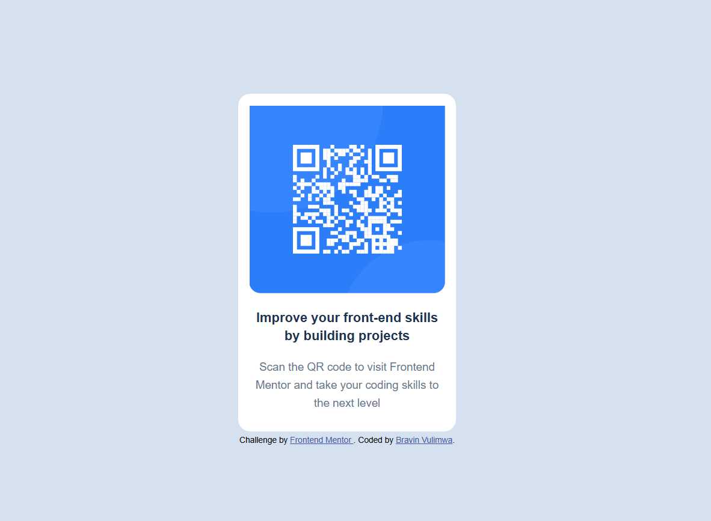

# Frontend Mentor Challenge: QR Code Component Solution

This is a solution to the [Frontend Mentor QR code component challenge](https://www.frontendmentor.io/challenges/qr-code-component-iux_sIO_H). The goal of this project is to build a simple and responsive QR code card using only HTML and CSS.

## Table of Contents
- [Overview](#overview)
- [Screenshot](#screenshot)
- [Links](#links)
- [Built With](#built-with)
- [Getting Started](#getting-started)
- [How to Use](#how-to-use)
- [Project Structure](#project-structure)
- [Author](#author)
- [Acknowledgments](#acknowledgments)

## Overview
This project is a beginner-level challenge from Frontend Mentor. It involves creating a card component that displays a QR code, a heading, and a short description. The focus is on practicing layout, alignment, and responsive design using CSS.

## Screenshot


## Links
- [Frontend Mentor Challenge](https://www.frontendmentor.io/challenges/qr-code-component-iux_sIO_H)
- [Live Site](#) <!-- Add your live site URL here if deployed -->

## Built With
- Semantic HTML5 markup
- CSS custom properties
- Flexbox
- Responsive design

## Getting Started
To get a local copy up and running, follow these simple steps:

1. **Clone the repository:**
   ```sh
   git clone <repository-url>
   ```
2. **Navigate to the project directory:**
   ```sh
   cd qr_code_component_soln
   ```
3. **Open `index.html` in your browser.**

No additional dependencies or build tools are required.

## How to Use
- Open `index.html` in any modern web browser.
- The QR code card should be centered on the page and responsive to different screen sizes.

## Project Structure
```
qr_code_component_soln/
│
├── index.html          # Main HTML file
├── style.css           # CSS styles
└── images/
    ├── favicon-32x32.png
    └── image-qr-code.png

```

## Author
- [Bravin Vulimwa](https://github.com/vulimwa)
- [Frontend Mentor Profile](https://www.frontendmentor.io/profile/your-username)

## Acknowledgments
- [Frontend Mentor](https://www.frontendmentor.io/) for providing the challenge and assets.
- Inspiration from the Frontend Mentor community.

